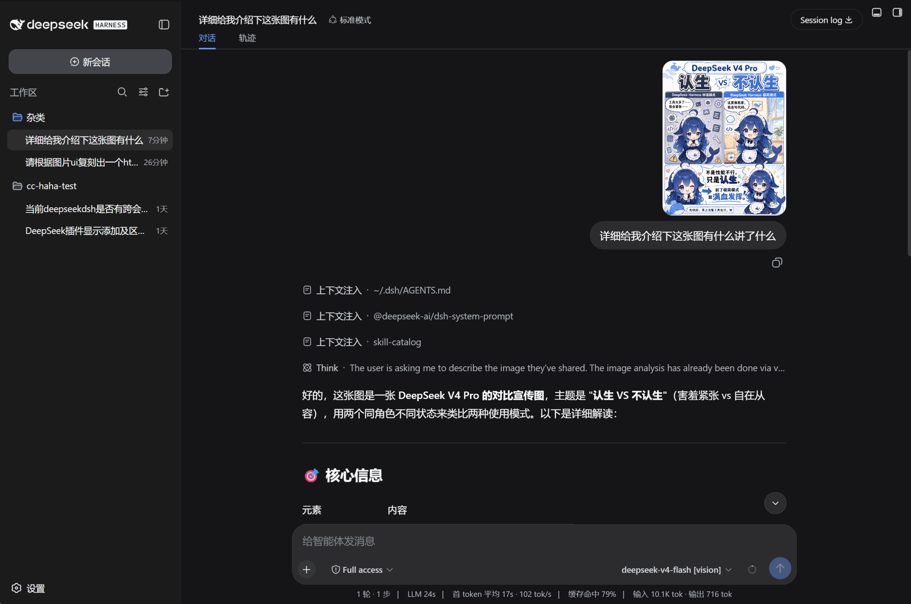
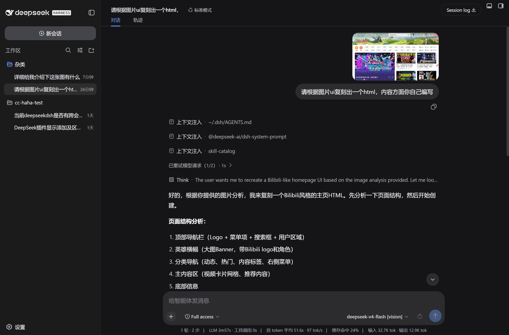
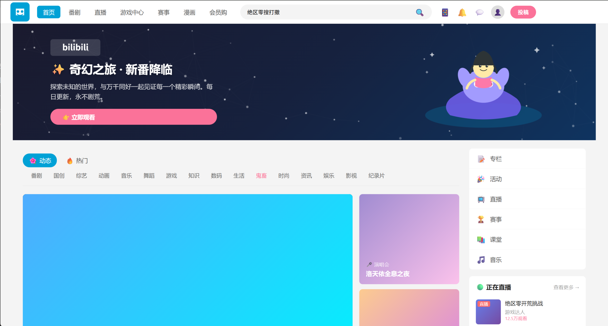

# dsh-tool-visual-primitives

A [DeepSeek Harness (DSH)](https://github.com/deepseek-ai/DeepSeek-Harness) plugin that gives text-only chat models a visual capability. It sends an image to an external vision model, then returns **plain-text visual evidence**—optionally with spatial references—to the original chat model. The chat model itself does not need native image input.

The design is inspired by DeepSeek's [Thinking with Visual Primitives](https://github.com/deepseek-ai/Thinking-with-Visual-Primitives): normalized coordinates and referenceable objects turn image understanding into evidence that later reasoning can inspect and use.

> The current release supports local source mounting from GitHub. The npm package has not been published yet; a one-line package installation command will be added after publication.

## Highlights

- Two entry points backed by one `vision_analyze` core: an explicit tool and `[vision]` chat-model variants.
- Automatic detection of 11 visual tasks: captioning, inventory, multi-subject, counting, grounding, spatial relation, comparison, path tracing, topology, UI, and document visual analysis.
- Three output-detail levels: `brief`, `standard` (default), and `verbose`.
- Three visual-primitive policies: `auto` (default), `on`, and `off`. Primitives use `<ref>`, `<box>`, and `<point>` with normalized `0–999` coordinates.
- Appends `[vision]` variants only for the text-only chat models you choose; original models stay unchanged.
- Session-scoped evidence caching: a follow-up reuses evidence only when it covers the new question; otherwise the image is read again.
- Native settings page for secure credential storage, connection checks, searchable `/models` discovery, custom model IDs, and collapsible provider/model selection.

## How It Works

```text
Image + user question
        │
        ▼
detectVisionMode() → shouldUsePrimitives() → buildVisionPrompt()
        │
        ▼
External vision model (OpenAI-compatible Chat Completions)
        │
        ▼
Plain-text visual evidence (optionally with primitives)
        │
        ▼
Original text model continues the answer
```

`Mode` and `Detail` are orthogonal: Mode selects the task, while Detail controls information density. `Primitives` decides whether structured spatial evidence is required.

## Requirements

- A working DSH **Web Profile**.
- Node.js `>= 20` and pnpm.
- An accessible vision-model service. By default the plugin uses OpenAI-compatible endpoints:
  - `POST <Base URL>/chat/completions`
  - Optional model discovery: `GET <Base URL>/models`

The vision provider and the enhanced text-model provider may be different.

## Install from a Local GitHub Clone

This is the installation path verified for the current release. You may use another source directory if you also update `$source`.

```powershell
$source = 'D:\DSH\dsh-tool-visual-primitives'
git clone https://github.com/InkshadeWoods/dsh-tool-visual-primitives.git $source

Set-Location $source
pnpm install
pnpm run build

Set-Location "$env:USERPROFILE\.dsh\profiles\web"
pnpm add "link:$source"
```

Then append the package name once to `dsh.profile.bundles` in `C:\Users\<your-user>\.dsh\profiles\web\package.json`. Keep all existing entries:

```json
{
  "dsh": {
    "profile": {
      "bundles": [
        "@deepseek-ai/dsh-base",
        "@deepseek-ai/dsh-web-app",
        "dsh-tool-visual-primitives"
      ]
    }
  }
}
```

Restart DSH completely:

```powershell
npx @deepseek-ai/dsh web
```

When the client UI changes for the first time, force-refresh the browser with `Ctrl+Shift+R`.

### Uninstall

Remove both the `dsh-tool-visual-primitives` dependency and its `dsh.profile.bundles` entry from the Profile's `package.json`, then run this in the Profile directory:

```powershell
pnpm install
```

Restart DSH. Credentials are managed by the DSH credential service; clear an API key from the plugin settings page when it is no longer needed.

## First-Time Setup

Open **Settings → Vision Analysis** in DSH, then:

1. Enter the **API Key**, **Base URL**, and vision model.
2. Select **Load models** to retrieve `<Base URL>/models`; the list is searchable.
3. If the service does not expose a model directory, enter a **Custom model ID** instead.
4. Select **Test connection**.
5. Configure analysis parameters, then choose the text-only chat models that should receive a `[vision]` variant.

Saved API keys are never shown again when the page is reopened. Entering a new value replaces the old key; **Clear API Key** removes it.

### API and Model Discovery

| Item | Behavior |
| --- | --- |
| Vision request | `POST <Base URL>/chat/completions` with `Authorization: Bearer <API Key>` |
| Model discovery | `GET <Base URL>/models` with `Accept: application/json` and the same API key |
| Discovery failure | A custom model ID remains available and does not prevent vision analysis |
| Xiaomi Mimo URLs | The plugin automatically uses the `api-key` header |

## Analysis Parameters

| Setting | Options / default | Purpose |
| --- | --- | --- |
| Visual primitives | `auto` / `on` / `off` (default: `auto`) | `auto` decides from Mode and Detail; `on` forces coordinate-based evidence; `off` requests plain-text evidence only. |
| Analysis detail | `brief` / `standard` / `verbose` (default: `standard`) | Controls output density; it does not alter task detection. |
| Retry mode | `off` / `on` / `format-only` (default: `off`) | When required primitives are missing, `on` re-reads the image; `format-only` preserves conclusions where possible and repairs formatting. |
| Maximum image size | `10 MB` | Applies to local files, remote images, and chat attachments. |
| Timeout | `180000 ms` | Maximum wait for one vision-model request. |
| Output-token budget | `auto` or manual (default: `auto`) | `auto` follows Detail: brief `1024`, standard `2048`, verbose `4096`. |

## The 11 Auto-Detected Modes

| Mode | Best for | Evidence focus |
| --- | --- | --- |
| `caption` | “What is this image?” | Overall summary and key objects |
| `object_inventory` | “What objects are present?” | Main-object list and positions |
| `multi_subject` | “Who is shown left to right?” | Subject ordering, features, and positions |
| `counting` | “How many buttons?” | Candidates, exclusions, and count |
| `grounding` | “Where is the red button?” | Target and candidate locations |
| `spatial_relation` | “Which side is A on?” | Relative position, occlusion, containment |
| `comparison` | “Compare these two areas” | Dimensions and visible evidence for each side |
| `path_tracing` | “How does the route go?” | Start, key points, end, uncertainty |
| `topology` | “Is the maze solvable?” | Connectivity, blockers, and conclusion |
| `ui_analysis` | “How do I use this screen?” | UI elements, state, location, next step |
| `document_visual` | “Explain this chart/poster” | Headings, text blocks, tables, reading order |

The highest-priority keyword match wins; `caption` is used when nothing matches. For example, “How many buttons are on this screen?” selects `ui_analysis` and then applies the selected Detail level.

## Usage

### Option 1: Chat with a `[vision]` Model

1. In **Chat visual models** settings, enable a text-only model.
2. Reopen the model list and select the new `Model name [vision]` entry.
3. Upload, paste, or drop an image, then ask your question normally.

The plugin replaces only image blocks with visual-evidence text. The selected original text model still produces the final answer.

For a follow-up that explicitly refers to the latest image, the plugin checks whether cached evidence covers the new task, detail level, and requested objects/locations. It re-analyzes the image when coverage is insufficient rather than treating an incomplete previous answer as fact.

### Option 2: Explicit `vision_analyze` Tool

The tool accepts **exactly one** image source: a local absolute path or an HTTP(S) URL.

```json
{
  "image_path": "D:/images/dashboard.png",
  "prompt": "Count the main clickable buttons and identify their positions"
}
```

```json
{
  "url": "https://example.com/chart.png",
  "prompt": "Explain the chart trend and identify unreadable labels"
}
```

Remote URLs cannot target localhost, private-network addresses, or include credentials. Redirects are rejected to reduce server-side request forgery risk.

### Evidence Format

When primitives are enabled, the external vision model is instructed to return evidence under these headings:

```text
[Mode]
[Visual Primitives]
[Observations]
[Relations]
[Uncertainty]
[Answer]
```

Location evidence looks like this:

```text
<ref>submit_button</ref><box>[[742, 861, 900, 930]]</box>
<point>[[125, 430], [210, 430], [300, 510]]</point>
```

All coordinates are relative `0–999` values, not source-image pixels.

## Verified End-to-End Scenarios

All assets and results are in [`test/`](test/).

| Scenario | Verified outcome |
| --- | --- |
| Chat image understanding | A `[vision]` model successfully read a DSH usage-mode comparison image and supplied a structured description to the text model. |
| Screenshot-driven UI recreation | A `[vision]` model interpreted a Bilibili home-page screenshot; the text model then generated an independent Bilibili-style HTML page from that evidence. |

**Image-understanding result**



**UI recreation flow and result**





These outcomes validate the current end-to-end chain. Generated results still depend on the external vision model, text model, prompt, and image quality.

## Development

```powershell
pnpm install
pnpm run build
```

`pnpm run build` generates the client bundle at `lib/client.js`. The server entry is `index.mjs`: restart DSH after changing it. Force-refresh the browser after changing the client UI.

## License

[MIT](LICENSE)

## Acknowledgements and References

- [Thinking with Visual Primitives](https://github.com/deepseek-ai/Thinking-with-Visual-Primitives)
- [DeepSeek Harness](https://github.com/deepseek-ai/DeepSeek-Harness)
- The provider-bridge design draws inspiration from [modlens](https://github.com/liustack/modlens)
