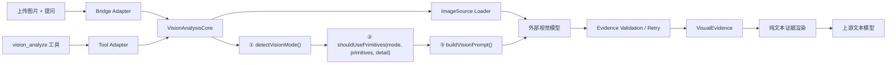

以下是可直接进入实施评审的完整修改方案。不会创建规格文件或修改代码；本方案以“两个入口、一个视觉原语核心”为唯一架构方向。

## 1. 目标与范围

目标：让不具备视觉能力的文本模型，通过统一的 `vision_analyze` 核心获得可引用的纯文本视觉证据；无论图片来自对话上传还是显式工具调用，均保留 11 种自动分析模式、由用户配置的三级 Detail（Brief、Standard、Verbose，默认 Standard），以及由用户配置的 Primitives（Auto、On、Off，默认 Auto）。

范围内：

- 两个入口统一到同一视觉分析核心；
- 保留现有 11 种分析模式；
- 保留用户配置的三级细节控制：Brief、Standard、Verbose，默认 Standard；
- 保留用户配置的 Primitives：Auto、On、Off，默认 Auto；
- 桥接使用当前用户问题，而不是固定的泛化描述；
- 统一证据格式、缓存、重试与错误处理；
- 保持 `vision_analyze(image_path | url, prompt)` 向后兼容。

范围外：

- 不让文本模型直接收到原始图片；
- 不增加第三种视觉分析路径；
- 不在本次重构中强依赖 DSH 尚未确认支持的图片框选 UI；
- 不改变外部视觉模型的 OpenAI 兼容协议。

## 2. 产品行为

### 两个入口

| 入口 | 面向谁 | 图片来源 | 调用方式 |
|---|---|---|---|
| 对话视觉入口 | 普通用户 | 对话附件 | 自动提取当轮问题，调用统一核心 |
| 显式分析入口 | 模型、高级用户、外部资源场景 | 本地路径或 URL | 显式调用 `vision_analyze` |

两者都走：

`用户发问 → ① detectVisionMode() → ② shouldUsePrimitives(mode, primitives, detail) → ③ buildVisionPrompt() → 视觉模型 → 纯文本证据 → 文本模型`

Mode 与 Detail 是正交控制：Mode 决定分析方向，Detail 决定信息密度。Primitives 决定是否采用坐标化视觉原语格式；当 Primitives 为 Auto 时，`shouldUsePrimitives()` 会参考 Mode 和 Detail 决定是否启用原语，这不会改变 Mode 或 Detail 本身。

### 11 种模式必须保持

保留现有 `detectVisionMode` 的模式和提示词体系：

1. Caption
2. Object Inventory
3. Multi-Subject
4. Counting
5. Grounding
6. Spatial Relation
7. Comparison
8. Path Tracing
9. Topology
10. UI Analysis
11. Document Visual

桥接入口把“当前含图片的用户消息”作为 `prompt` 输入，因此“找红色按钮”“数一数有几个”“表格关键结论是什么”都会进入对应模式，而非永远走 Caption。

### 三级细节控制：用户配置，默认 Standard

默认参数为：

```text
mode: "auto"
detail: "standard"
```

11 种模式始终由系统自动识别，不向普通用户暴露。Detail 由用户在设置页选择 `Brief`、`Standard` 或 `Verbose`，默认 `Standard`；该选择不改变 Mode，Mode 也不改变 Detail。结果不满足该模式的证据要求时，根据现有 `retry` 策略补充一次，而不是默认每张图重复分析。

- **Brief**：只列出回答问题所需的最少视觉基元
- **Standard**：列出主要视觉证据，给出必要的关系和不确定性
- **Verbose**：尽量完整列出关键对象、关系和不确定性

Brief 只减少证据数量和说明长度，不能让 Grounding、Counting、Path、Topology 等任务缺失必要的对象引用或坐标。Verbose 只增加可确认的证据，不能为了“完整”编造对象、关系或坐标。

### Primitives：用户配置，默认 Auto

- **Auto**：调用 `shouldUsePrimitives(mode, primitives, detail)` 自动决定是否要求 `<ref>`、`<box>`、`<point>` 等原语格式；
- **On**：强制要求适用任务输出视觉原语；
- **Off**：只返回可用的纯文本视觉证据，不要求视觉原语标签。

## 3. 目标架构



依赖方向必须单向：

- `Tool Adapter` 与 `Bridge Adapter` 只能依赖核心；
- 核心不得依赖 DSH 的工具注册或 LLM Adapter；
- 图片来源适配由核心统一处理；
- 外部模型传输、提示词生成、原语校验仅存在一份。

不要让桥接层通过 DSH 的“工具调用 UI”再调用 `vision_analyze`。正确做法是两个入口直接调用同一个内部函数，否则会出现递归、重复消息、不同错误行为和难以控制的工具记录。

## 4. 模块拆分

现有 [`index.mjs`](/D:/DSH/dsh-tool-visual-primitives/index.mjs:1) 同时包含提示词、HTTP、图片获取、工具与桥接注册，重构后应成为轻薄装配入口。

建议目录：

```text
index.mjs                         # 插件装配、读取配置、注册两个入口
vision/
  analysis-core.mjs               # 唯一分析编排入口 analyzeVision()
  mode-policy.mjs                 # detectVisionMode() 与 shouldUsePrimitives()
  prompt-builder.mjs              # 模式与视觉原语提示词
  image-source.mjs                # path / url / attachment 三种图片来源
  transport.mjs                   # OpenAI 兼容请求、响应解析
  evidence.mjs                    # VisualEvidence、渲染、校验
  evidence-cache.mjs              # 会话内缓存与稳定引用
adapters/
  tool-adapter.mjs                # vision_analyze 参数校验与注册
  bridge-adapter.mjs              # Provider Adapter、消息问题提取与证据替换
```

每个模块职责单一，避免再次形成一个 600 行以上的入口文件。

## 5. 核心接口与数据契约

### 内部请求

```ts
type AnalyzeVisionRequest = {
  source:
    | { kind: "path"; path: string }
    | { kind: "url"; url: string }
    | { kind: "attachment"; attachment: unknown };
  prompt: string;
  mode?: "auto";
  detail?: "brief" | "standard" | "verbose";
  primitives?: "auto" | "on" | "off";
  retry?: "off" | "on" | "format-only";
  conversationId?: string;
  signal?: AbortSignal;
};
```

其中 `detail` 是用户配置的实际等级，默认 `standard`，只控制输出信息密度；`primitives` 是用户配置的原语策略，默认 `auto`；模式识别始终独立地根据用户问题执行。

### 内部结果

```ts
type VisualEvidence = {
  imageId: string;
  mode: VisionMode;
  detail: "brief" | "standard" | "verbose";
  usesPrimitives: boolean;
  entities: Array<{
    id: string;
    label: string;
    box?: [number, number, number, number];
    confidence?: "high" | "medium" | "low";
  }>;
  points: Array<{ id?: string; values: Array<[number, number]> }>;
  observations: string[];
  relations: string[];
  uncertainty: string[];
  answer: string;
  renderedText: string;
};
```

`renderedText` 是文本模型唯一接收到的内容。`usesPrimitives` 为真时，继续采用现有兼容格式：

```text
[Mode]
[Visual Primitives]
[Observations]
[Relations]
[Uncertainty]
[Answer]
```

当 `usesPrimitives` 为假时，仍保留 Mode、Observations、Relations、Uncertainty、Answer 等纯文本证据，但不要求 `<ref>`、`<box>`、`<point>` 标签。启用视觉原语时，不破坏现有模型对这些标记的利用方式。

## 6. 两个入口的精确行为

### A. 对话视觉入口

1. 桥接识别当前轮是否新增图片附件。
2. 提取同一用户消息中的文本作为视觉问题。
3. 无文字时生成“建立主要可引用对象索引”的 Caption 请求。
4. 调用 `analyzeVision()`。
5. 将图片块替换为 `renderedText`，再转发给原始文本模型。
6. 在同一图片的后续追问中，优先读取会话证据；若新问题需要新的观察维度，则增量调用核心。

必须改掉当前桥接的固定提示词。现状在读取附件后使用固定“详细描述这张图片”的分析请求，导致当轮任务意图没有传给视觉模型。[index.mjs](/D:/DSH/dsh-tool-visual-primitives/index.mjs:422)

### B. 显式 `vision_analyze` 入口

继续支持：

```json
{
  "image_path": "C:\\path\\to\\image.png",
  "prompt": "找出红色按钮的位置"
}
```

以及：

```json
{
  "url": "https://example.com/image.png",
  "prompt": "统计图中车辆数量"
}
```

工具适配层只做：

- 必填参数与“路径/URL 二选一”校验；
- 调用 `analyzeVision()`；
- 返回 `{ text: evidence.renderedText }`。

现有参数校验可以迁移复用。[index.mjs](/D:/DSH/dsh-tool-visual-primitives/index.mjs:392)

## 7. 证据、缓存与跨轮引用

当前桥接缓存只按附件标识缓存一段通用文本，无法区分不同问题；同一图片换一个问题，可能错误复用旧证据。[index.mjs](/D:/DSH/dsh-tool-visual-primitives/index.mjs:518)

改为双层缓存：

- 基础证据缓存：`imageId + Caption + detail + usesPrimitives`，用于首次图片索引；
- 定向证据缓存：`imageId + mode + detail + usesPrimitives + promptFingerprint`，用于问题级复用；其中 `detail` 是用户选择的 Brief、Standard 或 Verbose。

`imageId`：

- 附件：DSH attachment ref；
- 本地路径与 URL：内容哈希优先；无法稳定取得时使用规范化来源标识；
- 对同一图片，后续请求把既有实体 ID 作为“已知引用”传给视觉模型，尽量保持 `subject_1`、`button_confirm` 等名称一致；
- 若不能可靠映射，明确输出“重新分析后引用已更新”，不能伪装为稳定同一对象。

稳定实体 ID、坐标引用和可视化证据仅在 `usesPrimitives` 为真时完整提供；关闭 Primitives 时，仅复用文本级问题证据，不承诺可跨轮引用的坐标化实体。

缓存上限、逐出策略和有效期应由配置控制；默认仅会话内保留，避免跨会话泄漏用户图片语义。

## 8. 原语校验与重试

现有逻辑只检查输出中是否任意出现一个原语标签。[index.mjs](/D:/DSH/dsh-tool-visual-primitives/index.mjs:198)
当 `usesPrimitives` 为真时，应升级为按模式的最小视觉原语证据规则：

| 模式 | 最低合格证据 |
|---|---|
| Counting | 候选对象引用，数量与候选一致 |
| Grounding / UI | 至少一个 `<ref>` 与 `<box>`，或明确不可定位 |
| Spatial Relation | 各关系对象的定位证据与关系说明 |
| Path / Topology | 起终点与 `<point>` 序列，或明确不可见原因 |
| Document Visual | 标题/表格/图表等结构区域的引用与定位 |
| Caption | Brief 下允许无坐标；Standard/Verbose 应有关键对象证据 |

当 `usesPrimitives` 为假时，不校验 `<ref>`、`<box>`、`<point>` 标签；只校验回答结构、任务结论和不确定性表达。

重试仍保留三档：

- `off`：按原结果返回；
- `on`：携图重新做任务级分析；
- `format-only`：保留结论，补齐结构和原语。

缺少原语标签只能在 `usesPrimitives` 为真时触发原语格式重试；Primitives 关闭时不得因缺少标签重试。

## 9. 设置与模型选择体验

当前客户端设置主要落在 `localStorage`，而服务端核心配置在插件加载时确定；这会使“已保存”与“实际生效”不一致。[client/index.js](/D:/DSH/dsh-tool-visual-primitives/client/index.js:18) [index.mjs](/D:/DSH/dsh-tool-visual-primitives/index.mjs:560)

重构原则：

- 凭据：只通过 DSH 凭据服务保存，不在 `localStorage` 长期存 API Key；
- 可动态生效的设置：必须有明确的后端配置通道；若 DSH 未提供，则 UI 不展示成“即时生效”；
- `mode` 固定显示为“智能自动”，不提供用户选择；`detail` 提供 `Brief`、`Standard（默认）`、`Verbose` 三选一，并在每次分析前通过明确的后端配置通道生效；
- `primitives` 提供 `Auto（默认）`、`On`、`Off` 三选一，并在每次分析前通过同一后端配置通道生效；
- 高级设置折叠为：最大图片大小、超时、重试策略、缓存上限、外部视觉服务；
- 当前写死的 `append` 选择器不能伪装为可配置项。[client/index.js](/D:/DSH/dsh-tool-visual-primitives/client/index.js:365)

细节选项的产品语义如下：

| 选项 | 行为 |
|---|---|
| Brief | 最少必要视觉原语；不省略定位、计数或路径任务的必要坐标 |
| Standard（默认） | 主要证据、必要关系与不确定性 |
| Verbose | 尽量完整的可确认对象、关系与不确定性 |

Primitives 选项的产品语义如下：

| 选项 | 行为 |
|---|---|
| Auto（默认） | 按 `shouldUsePrimitives(mode, primitives, detail)` 自动决定是否使用视觉原语 |
| On | 对适用任务强制输出视觉原语 |
| Off | 仅返回纯文本视觉证据，不要求原语标签 |

模型选择短期仍保留 `<原模型> [vision]` 作为 DSH Adapter 的技术载体，但应分组为“视觉增强”，并明确：

> 图片将发送至已配置的视觉服务；上游文本模型只接收视觉原语文本证据。

原生支持图片的上游模型不创建桥接副本。

## 10. 失败、安全与隐私

失败必须返回结构化、可理解的视觉失败状态；不能把内部异常原样拼入文本模型上下文后继续假装可回答。

图片 URL 安全策略：

- 仅允许 `http` / `https`；
- 限制重定向次数；
- 拒绝私网、回环、本机与链路本地地址，防止 SSRF；
- 检查响应媒体类型、实际字节数与最大尺寸；
- 对本地文件继续通过 DSH 的 `fs` 服务读取；
- 错误中不泄漏凭据、内部路径、完整上游响应体。

用户体验上，首次启用桥接应提示“图片会发送到哪个视觉服务”；失败时提供“重试 / 修改设置 / 不发送图片”的可见选择。

## 11. 分阶段修改任务

### 阶段 1：抽取无状态核心

目标文件：`vision/analysis-core.mjs`、`vision/mode-policy.mjs`、`vision/prompt-builder.mjs`、`vision/transport.mjs`

- 从 `index.mjs` 迁移模式识别、原语提示词、响应解析与重试；
- 保留 `mode: auto` 与三级 `detail` 配置，默认 `detail: standard`；
- 保留 `primitives: auto | on | off`，默认 `auto`，并按既定顺序执行 `detectVisionMode()`、`shouldUsePrimitives()`、`buildVisionPrompt()`；
- 产出 `VisualEvidence` 与兼容文本渲染；
- 保持原有视觉模型请求格式与 MiMo 兼容分支。

依赖：无。
对应需求：统一核心、11 模式、用户配置的三级 Detail。

### 阶段 2：统一图片来源与缓存

目标文件：`vision/image-source.mjs`、`vision/evidence-cache.mjs`

- 合并现有本地路径、URL、attachment 三套图片读取分支；
- 实施来源与内容限制；
- 用请求语义与 `usesPrimitives` 作为缓存键，替代只按 attachment 缓存；
- 支持会话级稳定实体引用。

依赖：阶段 1。
对应需求：两个入口一致、跨轮追问、安全与成本控制。

### 阶段 3：迁移显式工具入口

目标文件：`adapters/tool-adapter.mjs`、`index.mjs`

- 迁移现有 `vision_analyze` 参数校验；
- 通过新核心返回同格式纯文本；
- 保持现有名称、参数和返回值，确保兼容。

依赖：阶段 1、2。
对应需求：旧调用无迁移成本。

### 阶段 4：迁移桥接入口

目标文件：`adapters/bridge-adapter.mjs`、`index.mjs`

- 从含图片的当前用户消息提取问题；
- 调用核心，不再自行构造“通用描述”；
- 仅把统一纯文本证据传给上游模型；
- 新问题出现时按缓存策略增量补证；
- 保留 `[vision]` 模型展示作为短期兼容。

依赖：阶段 1、2。
对应需求：无感上传读图、模式与问题一致。

### 阶段 5：设置页与说明同步

目标文件：[`client/index.js`](/D:/DSH/dsh-tool-visual-primitives/client/index.js:1)、[`README.md`](/D:/DSH/dsh-tool-visual-primitives/README.md:1)、[`README_EN.md`](/D:/DSH/dsh-tool-visual-primitives/README_EN.md:1)

- 移除或修正无法真正生效的配置项；
- 设置页提供 Detail 的 `Brief`、`Standard（默认）`、`Verbose` 三选一，以及 Primitives 的 `Auto（默认）`、`On`、`Off` 三选一；说明 Detail 只控制输出信息密度，不影响自动识别的 Mode；
- 增加图片外发、缓存和失败行为说明；
- 文案从“双运行模式”改为“两个入口、统一视觉原语核心”。

依赖：阶段 3、4。
对应需求：可理解、可预期的用户体验。

## 12. 验收标准

- 对话上传图片并询问“图中有几个杯子”，桥接调用 Counting，而不是通用 Caption。
- 直接调用 `vision_analyze` 对同一问题，得到相同模式、同级细节与同类原语结构。
- 默认 Detail 为 Standard；用户选择 Brief、Standard 或 Verbose 后，该选择在两个入口一致生效，且不改变自动识别的 Mode。
- 手动 Brief 不会删除任务必需的 `<ref>`、`<box>` 或 `<point>`。
- Primitives 为 On 时，适用任务输出规定的视觉原语；为 Off 时，输出仍是可用的纯文本证据，但不要求原语标签。
- Primitives 为 Auto 时，是否输出原语与 `shouldUsePrimitives(mode, primitives, detail)` 的结果一致；相同图片与问题在不同原语策略下不得错误复用缓存。
- “按钮在哪”“左边的人是谁”“路线是否可达”“这张表的关键数字”分别进入对应模式。
- 文本模型上下文中不包含原始图片块，只包含视觉原语纯文本证据。
- 同图不同问题不复用无关旧结果；同图同问题可复用结果。
- 图片无法读取、视觉服务失败或不符合证据要求时，系统显式报告失败/不确定性，且不泄漏敏感数据。
- 旧的 `vision_analyze` 路径、URL 与 `prompt` 调用方式保持可用。
- 客户端不再显示“看似已生效、实际未生效”的设置。

## 实施前置条件

开始编码前，应先确认 DSH 是否提供可使 Detail 与 Primitives 设置实时传递到后端核心的配置通道；若不提供，设置页必须明确显示配置何时生效，不能展示为即时生效。
